# Тестування працездатності системи

*В цьому розділі я використовував платформу
Postman для тестування працездатності мого API*

### Запуск сервера
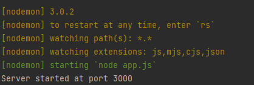

### Тестування для Role

#### Get/Role

#### Get/Role/:id

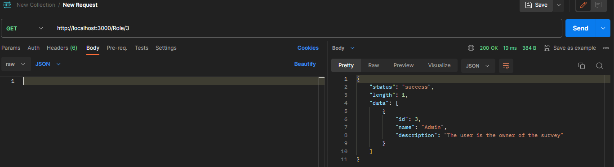

#### Post/Role

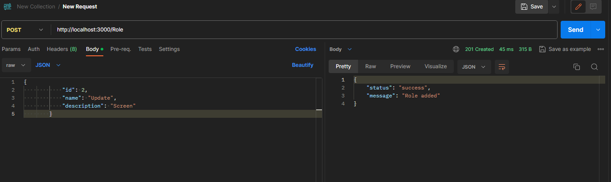

#### Put/Role

#### Delete/Role

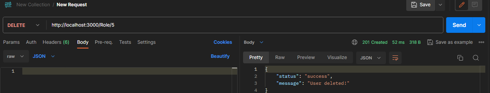

### Тестування для User

#### Get/User

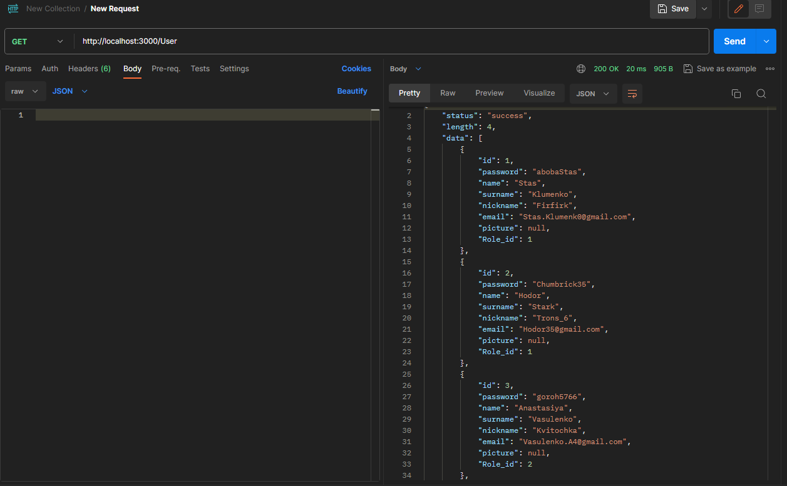

#### Get/User/:id

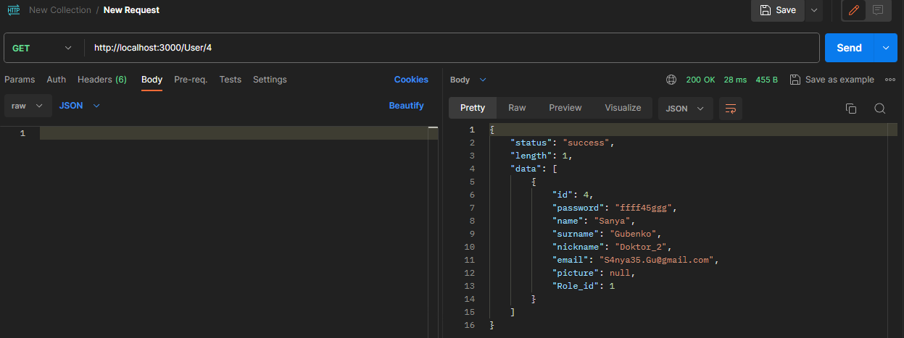

#### Post/User

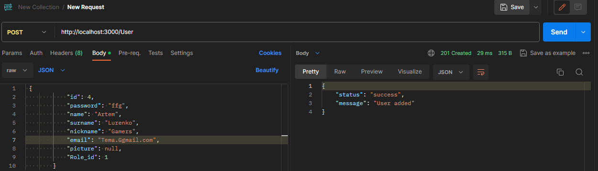

#### Put/User

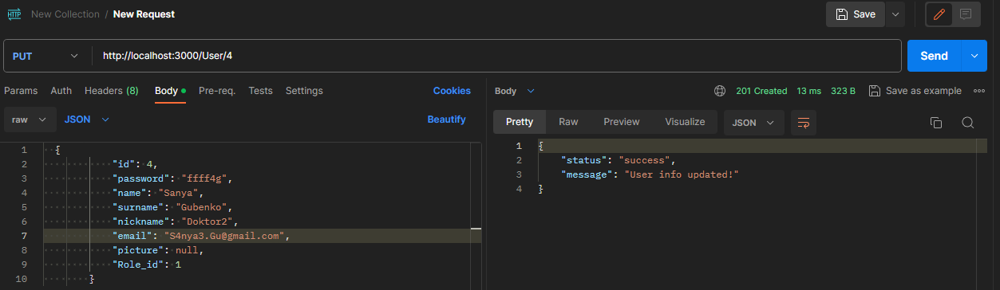

#### Delete/User

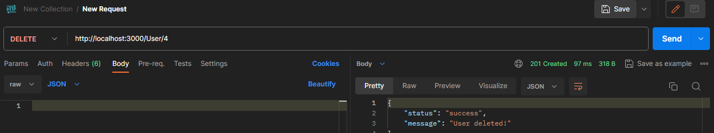

### Тестування для Quiz

#### Get/Quiz

#### Post/Quiz

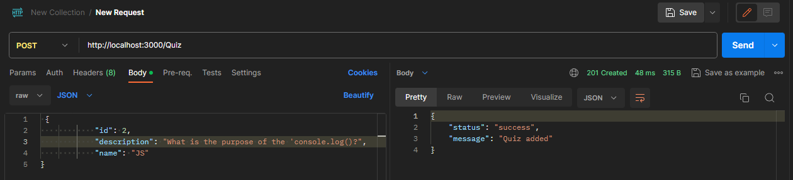

#### Put/Quiz

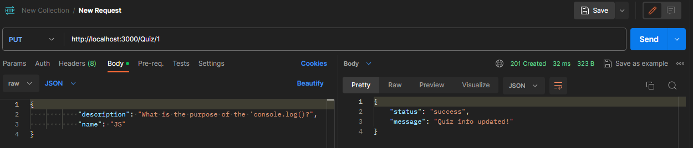

#### Delete/Quiz

