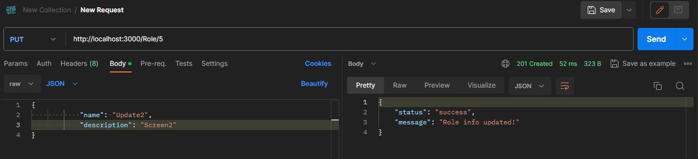
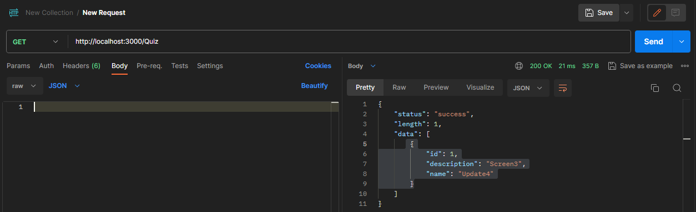

# Тестування працездатності системи

*В цьому розділі я використовував платформу
Postman для тестування працездатності мого API*

### Запуск сервера

### Тестування для Role

#### Get/Role

#### Get/Role/:id

#### Post/Role

#### Put/Role

#### Delete/Role

### Тестування для User

#### Get/User

#### Get/User/:id

#### Post/User

#### Put/User

#### Delete/User

### Тестування для Quiz

#### Get/Quiz

#### Post/Quiz

#### Put/Quiz

#### Delete/Quiz

